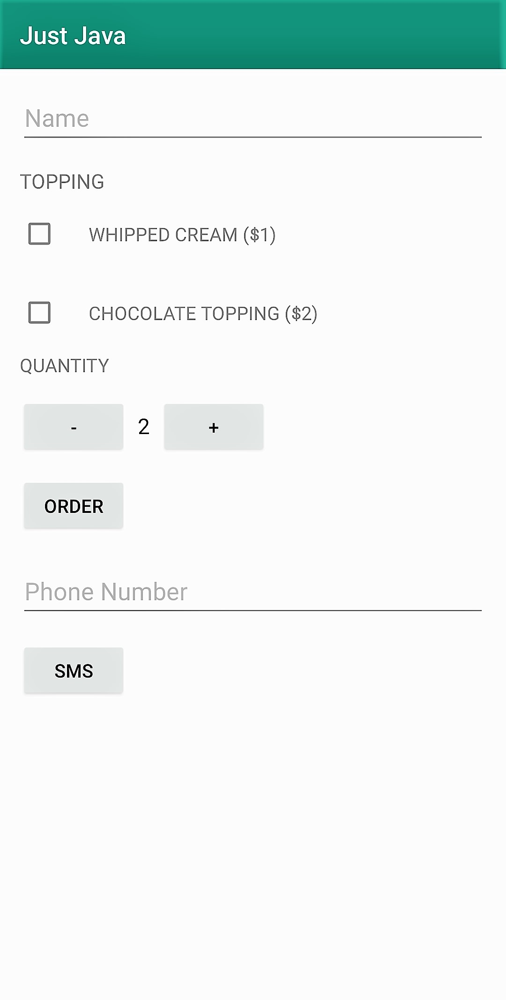
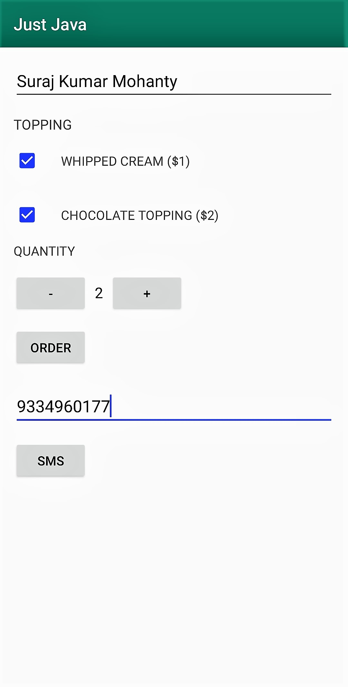
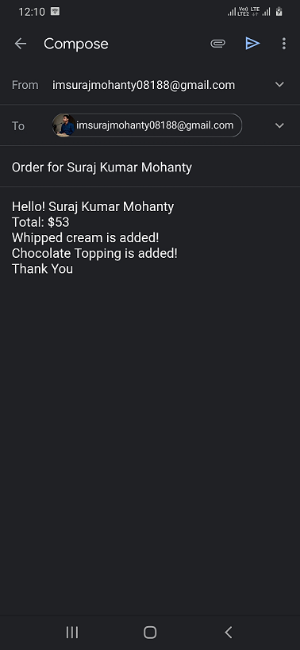
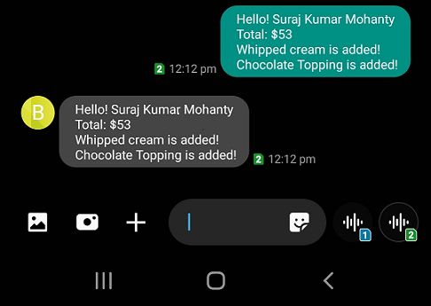

# Just Java
=================================

A sample app which creates a bill and sends it to your mail and your phone number.
Encourages paperless billing system.

### Pre-requisites
-------------------

- Android SDK v30
- Android Build Tools v30.0.2

This sample uses the Gradle build system. To build this project, use the
"gradlew build" command or use "Import Project" in Android Studio.

### Homescreen Image

### After filling details

### After Pressing Order

### After Pressing SMS

